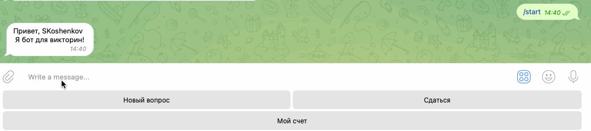

# Бот-викторина.
Данные скрипты позволяет помочь создать бота для проведения викторины в ВК и Телеграм.
Попробовать можно в [ВК](https://vk.com/im?sel=-210042253) и [Телеграм](https://t.me/Quiz_Stx_bot)
Ну или посмотреть демо: 
### Как установить
- [Python3](https://www.python.org/downloads/) должен быть уже установлен. 
- Установить [виртуальное окружение](https://python-scripts.com/virtualenv).

1. Настройки для бота ВК.
- Создайте [группу вконтакте](https://vk.com/groups).
- [Получите токен](https://dvmn.org/media/filer_public/2f/11/2f11a34a-1de3-4acc-838d-d1be37bd6828/screenshot_from_2019-04-29_20-10-16.png) в настройках группы.
- Разрешите [отправку сообщений](https://dvmn.org/media/screenshot_from_2019-04-29_20-15-54.png) в настройках. 
- Запишите полученный токен в '.env' как:
```python
VK_TOKEN='тут ваш токен'
```
  
2. Настройки для бота Телеграм.
- Создайте Телеграм бота  и получите токен. Сделать это можно тут: [BotFather](https://telegram.me/BotFather), для этого необходимо
ввести `/start` и следовать инструкции.
- Запишите полученный токен в '.env' как:
```python
TG_TOKEN='тут ваш токен'
```  
- Запустите полученного бота при помощи команды `/start`.

3. Поднять базу данных на [Redis](https://redis.com).
- Запишите полученные параметры в '.env' как:
```python
REDIS_PORT='тут ваш порт'
``` 
```python
REDIS_PASSWORD='тут ваш пароль'
``` 
```python
REDIS_HOST='тут ваш хост'
```

4. Добавить название папки с файлами вопросов и ответов.
```python
QUIZ_QUESTIONS_FOLDER='тут путь до папки'
```

### Как запустить
1. Скачайте код
2. Установите зависимости командой:
```bash
pip install -r requirements.txt
```
3. Запустите скрипт:
```bash
python3 vk_quiz_bot.py
```
и/или
```bash
python3 tg_quiz_bot.py
```

### Как запустить на Хероку
1. Зарегистрируйтесь на [Хероку](https://id.heroku.com/login)
2. Создайте приложение (app). 
3. Привяжете аккаунт GitHub к аккаунту Heroku во вкладке Deploy и нажмите Deploy Branch.
   Если не получилось привязать аккаунт, воспользуйтесь [инструкцией для терминала](https://devcenter.heroku.com/articles/git)
4. Заполните чувствительные данные Config Vars из файла `.env` во вкладке Settings.

5. Активируйте Dyno во вкладке Resources. 

Готово, теперь ваш бот будет работать постоянно.

## Цель проекта

Код написан в образовательных целях на онлайн-курсе для веб-разработчиков [Devman](https://dvmn.org).
